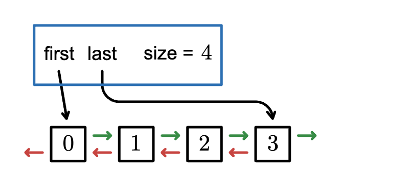
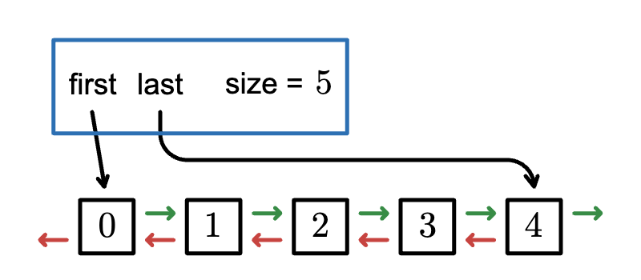

# Doubly-Linked Generic Queue

This is a portion of our larger grocery store simulation project, which will
close out the Fall semester.

## Implementing `QueueInterface`
Create a class that implements `structures.QueueInterface`. The queue you are
implementing should be unbounded and meet the big-O time complexities specified
in the interface. A skeleton class, `LinkedQueue`, has been provided.

You can ignore the `config.Configuration` class for now, it will be explained
later when we look at the full grocery store project.

We are really implementing a **deque** (pronounced "deck"), which is short for
double ended queue. Implementing a full double ended linked list is a pain -
there is a lot of plumbing to do when you add something to the middle of the list,
and you need to hook up all the previous nodes and next nodes. But with a deque,
you only need to access the front and the rear of the list, which is much simpler,
and also stays efficient.

Each node now has both a `next` and a `previous` node reference, as well as an
element of generic type `T`. This has been coded for you, in the `QNode` class.
You should not need to edit this class.

**Tip:** Don’t try to implement your entire `LinkedQueue` class all at once.
Start by looking at the tests provided in `QueueInterfaceTest`. Start with the
test that looks the least complex, and implement the parts that will allow that
test to pass. Once those tests pass, look for another test to implement.

Both the `enqueue` and `dequeue` methods have special cases that will need to be
handled separately. Those special cases involve adding the first node to an empty
list, and removing the last node from a single-element list. The general case
involves careful thinking about the links you are creating and destroying, and
also performing the steps in the correct order. Think of how you would go from
the deque above and add a new element to the rear of the list.

You can find some information about queues and deques in Chapter 5 of
*Java Software Structures* by Lewis and Chase, but bear in mind that
their code examples are for a singly linked queue.

**Note**: For obvious reasons, you may not use any of the provided `Collection`
classes in the java standard API. A list of them can be seen in the
[Outline of the Collections Framework](https://docs.oracle.com/en/java/javase/17/docs/api/java.base/java/util/doc-files/coll-reference.html)
